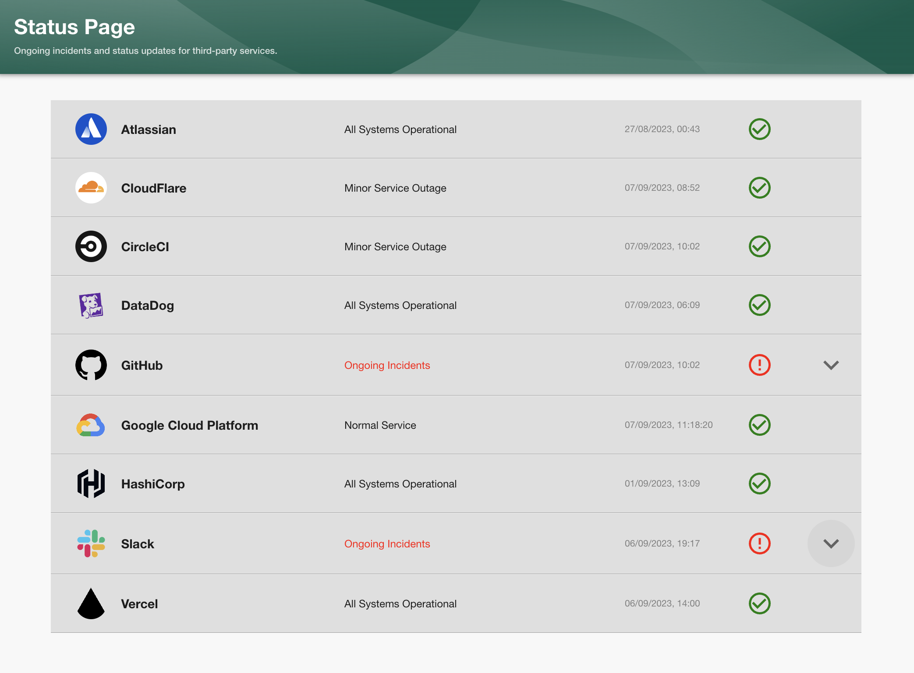
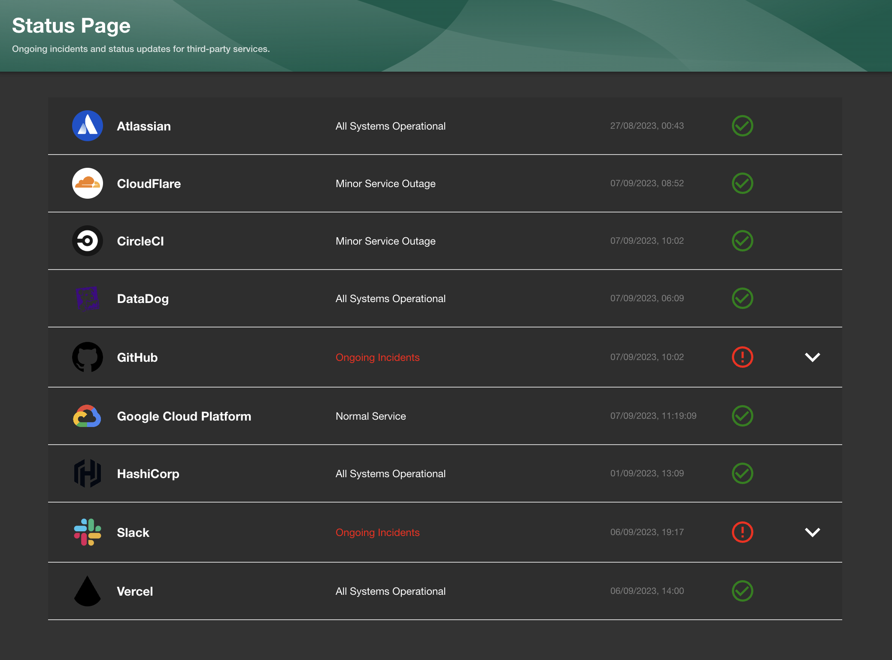
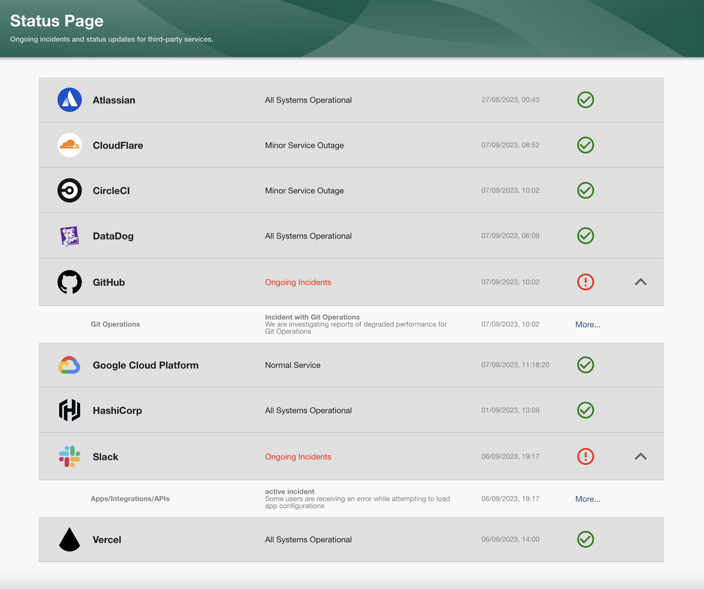
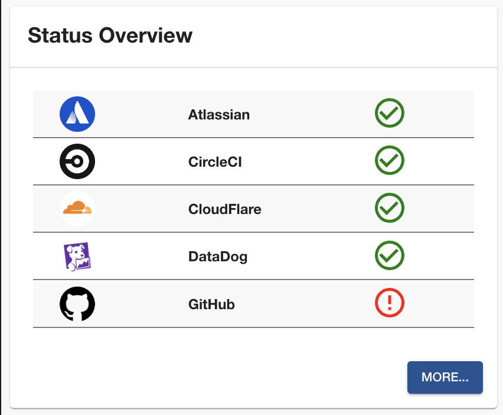
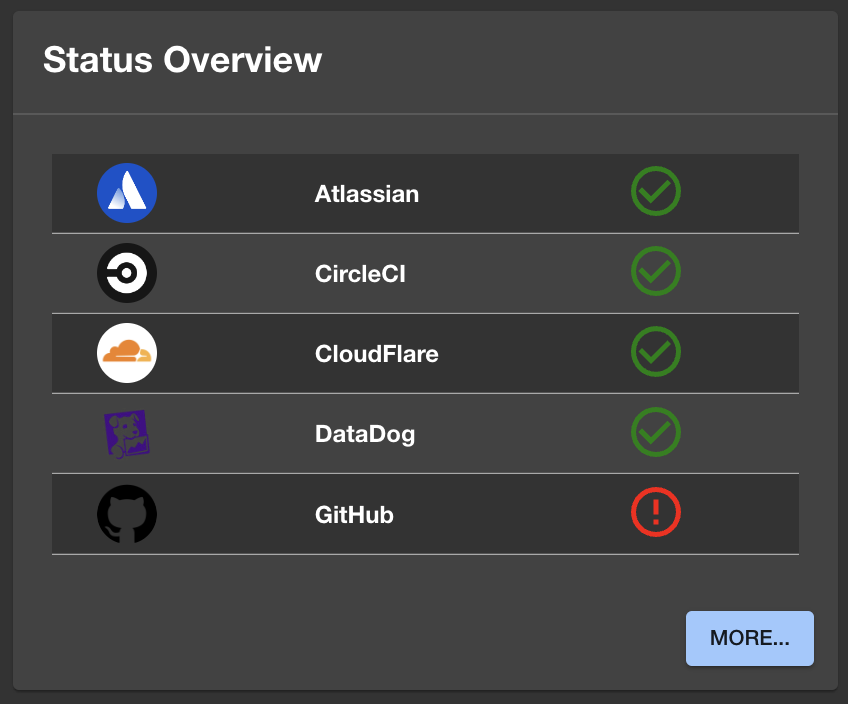

# Backstage Plugin: service-health

Welcome to the service health plugin for [Backstage!](https://backstage.io/)

This plugin displays the status and active incidents of third party services directly in Backstage.

### Plugin Features:

- This plugin uses the third party services public status API.
- Real time display of services current status.
- If an active incident is happening the drop down will appear to display more details.
- Only the most recent incident update message is displayed.
- Links to the services full public dashboards and to the specific ongoing incident.
- A Card component to display an overview of the status's on the homepage.
- Ability to enable slack notifications for alerting of new incidents.

 

Service Health page default display:

Dark mode:

When an ongoing incident is happening, the drop down tables become available to open for more information:

Home page card:

Dark mode:

## Getting started

- [Frontend installation instructions](docs/frontend-installation.md)
- [Backend installation instructions](docs/backend-installation.md)
- [Contributing guide](docs/contributing.md)
