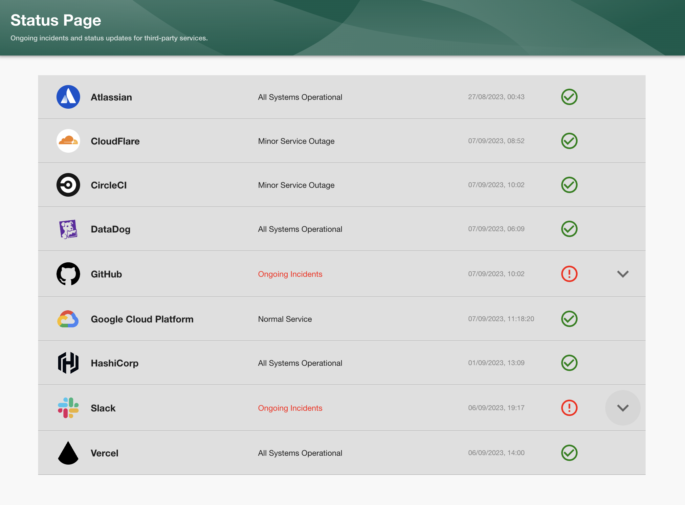
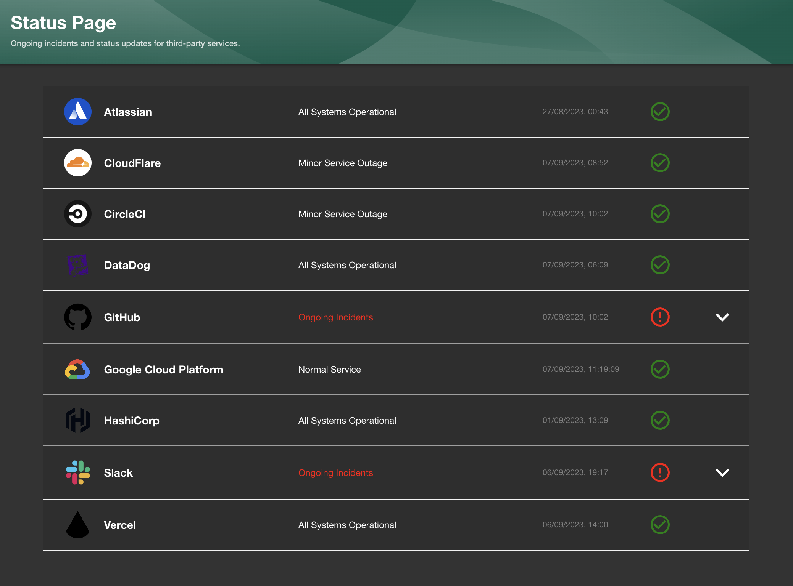
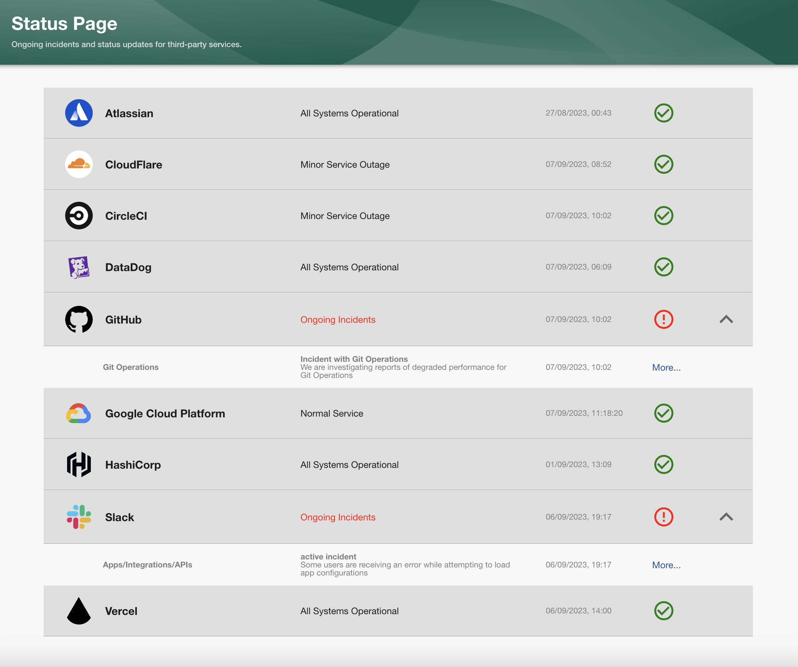
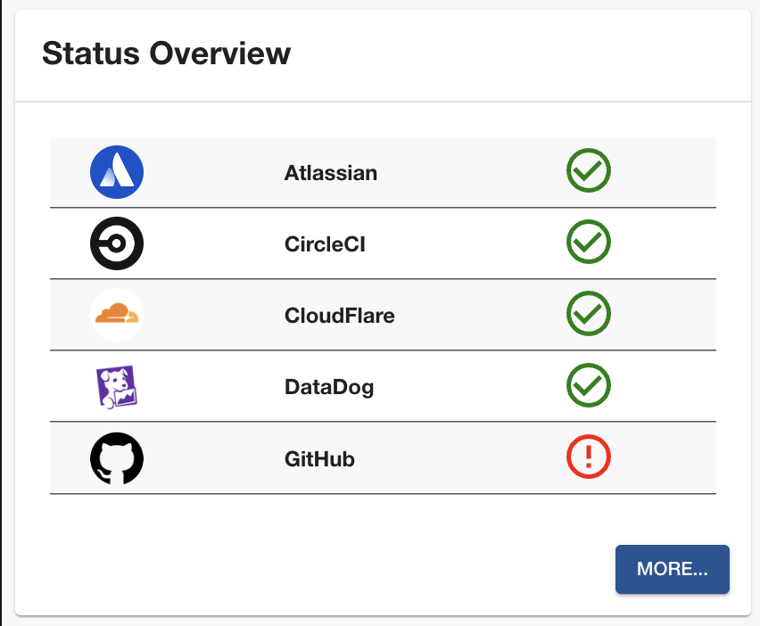
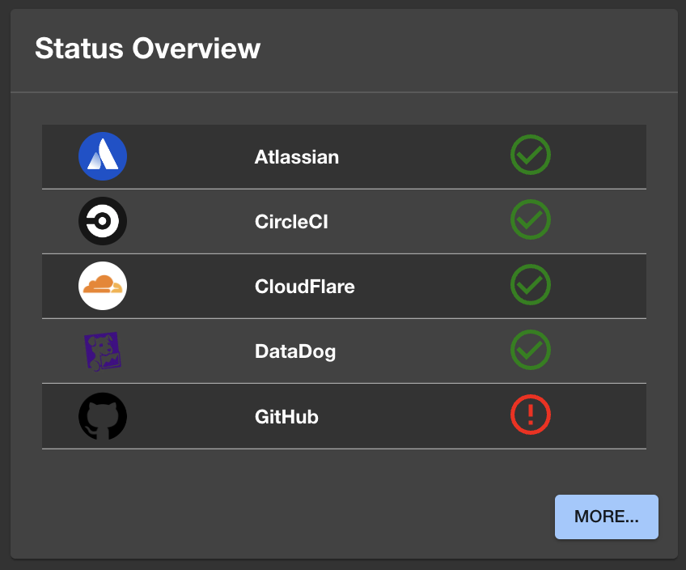

# Backstage Plugin: service-health-dashboard

Welcome to the service health plugin for [Backstage!](https://backstage.io/)

This plugin displays the status and active incidents of third party services directly in Backstage.

### Plugin Features:

- This plugin uses the third party services public status API.
- Real time display of services current status.
- If an active incident is happening the drop down will appear to display more details.
- Only the most recent incident update message is displayed.
- Links to the services full public dashboards and to the specific ongoing incident.
- A Card component to display an overview of the status's on the homepage.
- Ability to enable slack notifications for alerting of new incidents.

<br/>

Service Health page default display:



Dark mode:


When an ongoing incident is happening, the drop down tables become available to open for more information:



Home page card:


Dark mode:


# Frontend Installation

Add the package to your frontend application:

```bash
npm install @sammbetts/backstage-plugin-service-health-dashboard
```

Modify your app routes in `packages/app/src/App.tsx`:

```diff
+ import { ServiceHealthDashboardPage } from '@sammbetts/backstage-plugin-service-health-dashboard';

const routes = (

  <FlatRoutes>
    ...
+   <Route path="/service-health" element={<ServiceHealthDashboardPage />} />
    ...
  </FlatRoutes>
);
```

Add the **Service Health** icon to the Sidebar in `packages/app/src/components/Root/Root.tsx`:

```diff
+ import CheckCircleOutlineIcon from '@material-ui/icons/CheckCircleOutline';

  <SidebarGroup label="Menu" icon={<MenuIcon />}>
    ...
+   <SidebarItem icon={CheckCircleOutlineIcon} to="service-health" text="Service Health" />
    ...
  </SideGroup>
```

To use the Card component, add to your home/landing page:

```ts
import { ServiceHealthOverviewCard } from '@sammbetts/backstage-plugin-service-health-dashboard';

...
<Grid item>
  <ServiceHealthOverviewCard title="Status Overview"/>
</Grid>
...
```
You will also need to install the [service-health-backend](https://www.npmjs.com/package/backstage-plugin-service-health-backend)
